<div align="center">

# Burndown

### See the limit coming.

<a href="https://github.com/maz0x/burndown/releases/latest"></a>


</div>

Claude plans come with hard limits: a rolling 5-hour session, a weekly
allowance, separate caps per model. Hit one mid-task and you are simply
stopped, sometimes for hours. Burndown is a native Mac menu bar app that
watches those limits so you never meet one by surprise. It shows how much
you have left, tells you which conversation is spending it, forecasts when
you will hit the wall at your current pace, and warns you before it
happens instead of after.

Under the small menu bar glyph is a real analytics tool: two dozen charts,
per-chat and per-project attribution, a time-to-limit forecast, adaptive
runaway-burn detection, spend budgets, a weekly recap, CSV/JSON/Markdown
export, and a local JSON API your scripts can read. And because it sits
in your eyeline all day, it is built to be looked at: twenty-plus color themes,
real glass, and a card where every element answers to you.

**[Download Burndown](https://github.com/maz0x/burndown/releases/latest)**
for macOS 13 or later, Apple Silicon and Intel. Free and open source.
It keeps itself up to date from here on.

**[Home page](https://maz0x.github.io/burndown/)** ·
**[Full guide](https://maz0x.github.io/burndown/guide.html)** ·
**[Discussions](https://github.com/maz0x/burndown/discussions)**

> Releases are signed ad hoc for now, so macOS asks once on first open:
> right-click Burndown.app, choose Open, then Open again. Or
> [build from source](#install) in one command and skip the question.

<p align="center">
  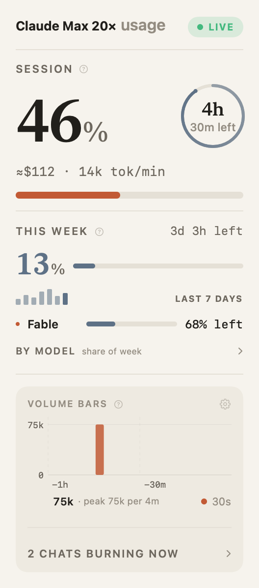
  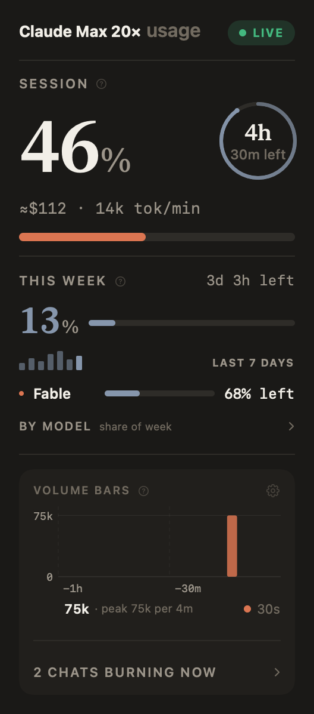
</p>

## The whole picture, one click away

Click the menu bar and the card opens: your 5-hour session and your week
as big serif percentages with time to reset, every per-model weekly cap,
live tokens per minute, and what the same work would have cost at API
prices. A "chats burning now" list shows each conversation using tokens
at this moment, busiest first, with its rate over the last minute;
right-click any row to rename it to whatever you actually call that
conversation. Every number explains itself on hover, in plain English.

These are not guesses. In live mode Burndown reads the same server-side
figures behind Claude's own usage page, then layers your exact local
token counts on top. A status badge always says what you are looking at:
LIVE, EST, STALE, LIMITED, or OFFLINE. When the app cannot know, it says
so instead of pretending.

The Account window rounds it out: your plan, both reset clocks, every
model with its own cap shown as "% left", and a by-model attribution of
where the week actually went. One click re-reads your plan, so an upgrade
shows up immediately. There is also an optional Developer API section:
give it an Admin key (`sk-ant-admin...`, created at console.anthropic.com)
and Burndown tracks a separate pay-as-you-go API account alongside the
subscription, month-to-date and today's spend, as one quiet line at the
bottom of the card. It is additive only, never touches the subscription
gauges, and the key stays on this Mac.

<p align="center">
  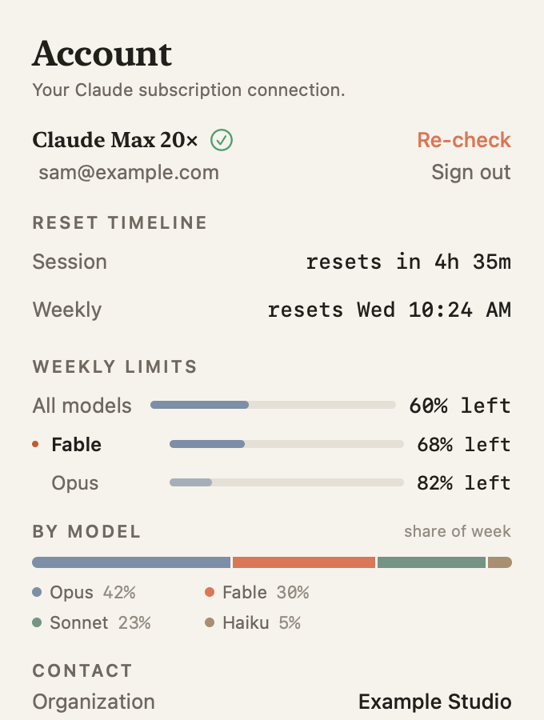
</p>

A note on the dollar figures: cost numbers are estimates from public API
list pricing, not billing truth. On a subscription you do not pay them.
They answer one question: what would this work have cost at API prices.

## It tells you which chat spent your session

Most monitors tell you that you are at 80%. Burndown tells you what got
you there. The Insights window attributes usage where other tools stop at
totals:

- **Current session, by model.** What the active 5-hour block is made of.
- **Biggest chats, all time.** Each row is one conversation, labeled with
  its own title, with tokens and estimated cost. The conversation that
  quietly ate your week has a name here.
- **Every project, ranked.** All-time tokens and cost per project, with
  lifetime totals underneath.
- **A weekly recap in words**, a 14-day history, and advisory lines for
  pacing, model mix, and budget when they have something worth saying.
- **One-click export** of every usage record to CSV, JSON, or Markdown,
  saved to Downloads. Deterministic output, stable columns, ready for a
  spreadsheet or an expense note.

<p align="center">
  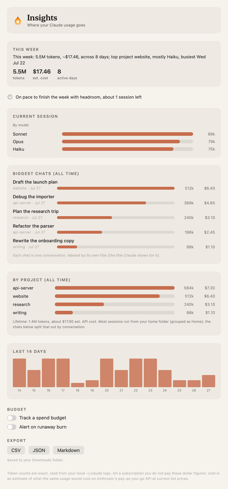
</p>

## It sees the wall before you hit it

- **Time-to-limit forecast.** Burndown projects your last 90 minutes of
  usage forward and, when the current pace would reach the cap before the
  window resets, the card says so: "~45m to limit". When the pace is flat
  or the reset comes first, it stays silent. A forecast that cries wolf
  is worse than none.
- **Weekly pacing.** Plain-language projections like "At this pace you
  reach the weekly cap in ~14h, before the reset" or "On pace to finish
  the week with headroom, about 3 sessions left".
- **Model-mix advice.** When Opus crosses 75% of its weekly cap, a gentle
  nudge: "You are at 80% of your Opus weekly limit, shift routine work to
  Sonnet". Quiet otherwise.
- **Pace gauge.** A chart of your current pace against the pace that
  would last exactly to the reset. Past 1.0x you are overspending.

## Alerts that watch while you are at lunch

Everything here is off by default and opt-in per alert.

- **Thresholds** for session, weekly, Opus, and Sonnet, each at your own
  percentage, plus window-reset notices.
- **The forecast alert** fires when the projected time to your session
  limit drops under a threshold you set: "about 25 min to your session
  limit", while there is still time to wrap up.
- **Burn spikes** name the culprit: "Fix the parser is burning 62k
  tokens/min."
- **Runaway detection** is adaptive, not a fixed number. Burndown learns
  your normal rate from the median of recent samples and flags a burn
  running far above it: "Burn is 5.2x your normal rate, possible runaway
  loop." It works whether your normal is 2k tokens/min or 80k, and it is
  built for exactly one scenario: the agent that keeps spending while you
  are away from the desk.
- **Budgets** are soft targets you set yourself, in dollars or tokens,
  per day or per week, with pacing: "On pace to use 1.3x your weekly
  budget" arrives before the line is crossed, not after.
- **An opt-in weekly digest**, once on Mondays: tokens and estimated cost
  for the week.

And the hygiene matters as much as the alerts: each threshold fires once
per window and re-arms on reset, spike alerts use hysteresis so they do
not flap, a persistent dedup backstop makes repeat notifications
impossible even across restarts, every banner has a Snooze button, quiet
hours silence the lot on your schedule, and the six alert sounds (Ember,
Chime, Drop, Pulse, Bloom, Knock) are original chimes made for the app.

<p align="center">
  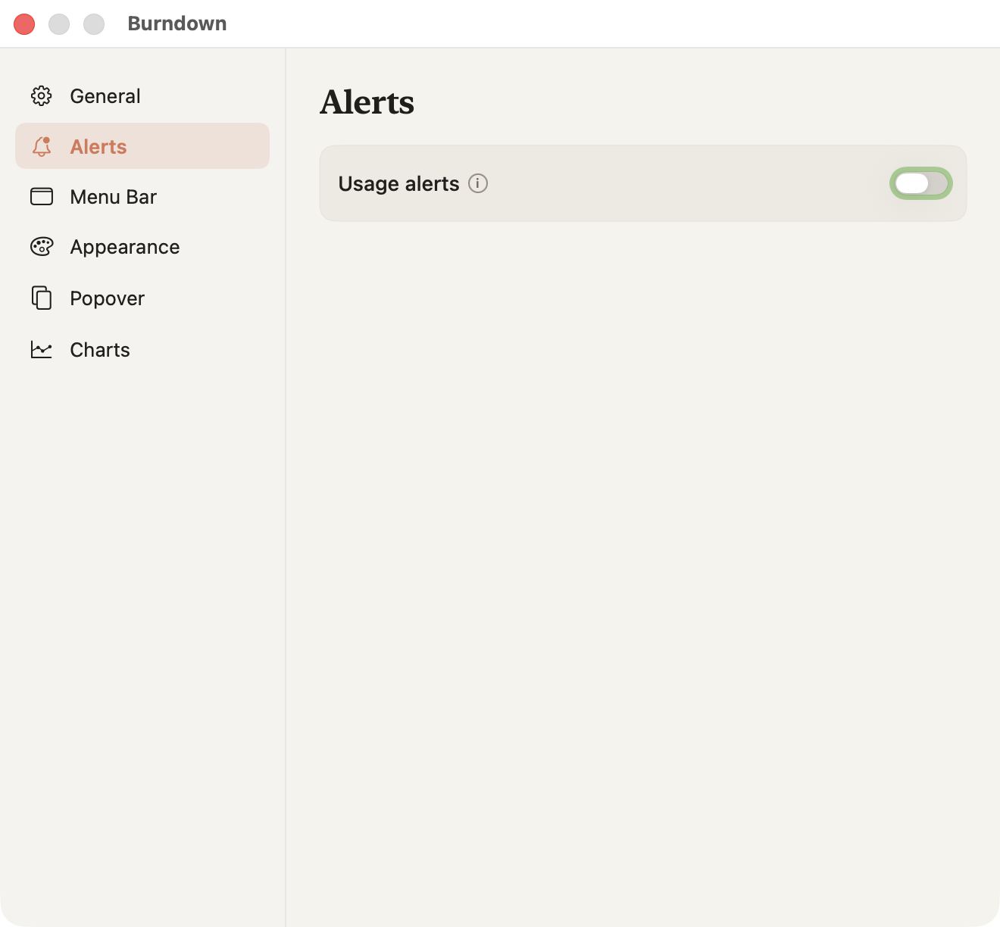
</p>

## Two dozen charts, grouped by the question they answer

Burn data is spiky: long flat stretches punctuated by bursts. No single
chart suits every question, so Burndown ships 24 and lets you pick. The
card stacks up to six; every chart has the same hover-to-scrub readout
and time windows from 30 minutes to all time.

**Burn: how hard are you pushing right now.** Burn rate, burn steps,
volume bars, cumulative tokens, and a burn distribution histogram whose
long tail shows your rare huge bursts.

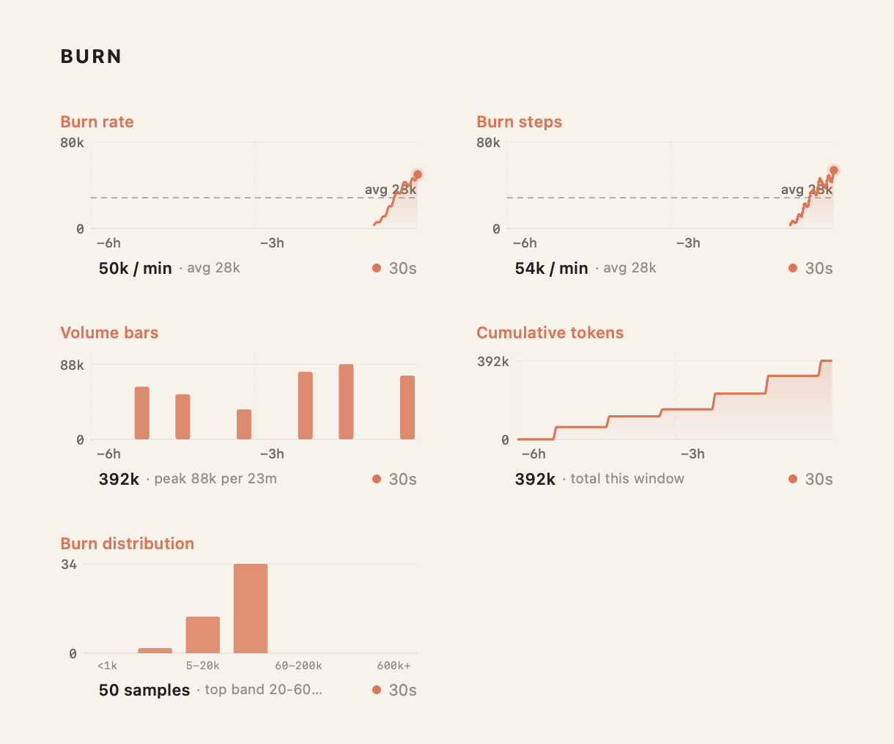

**Limits: will you make it to the reset.** Session and week burndowns
against the pace that lasts exactly to the reset, both usage percentages
on one scale, the pace gauge, and every model cap side by side.

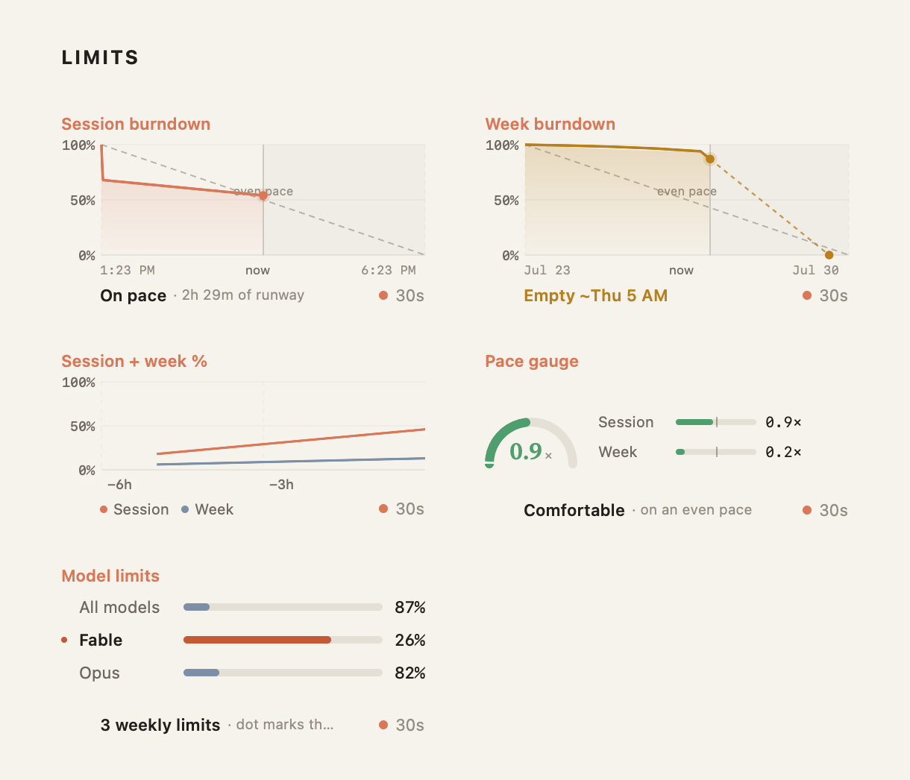

**Breakdown: where did it go.** Tokens by model and by project, cost per
day, the top chats in the window, and proportional model and project
mixes.

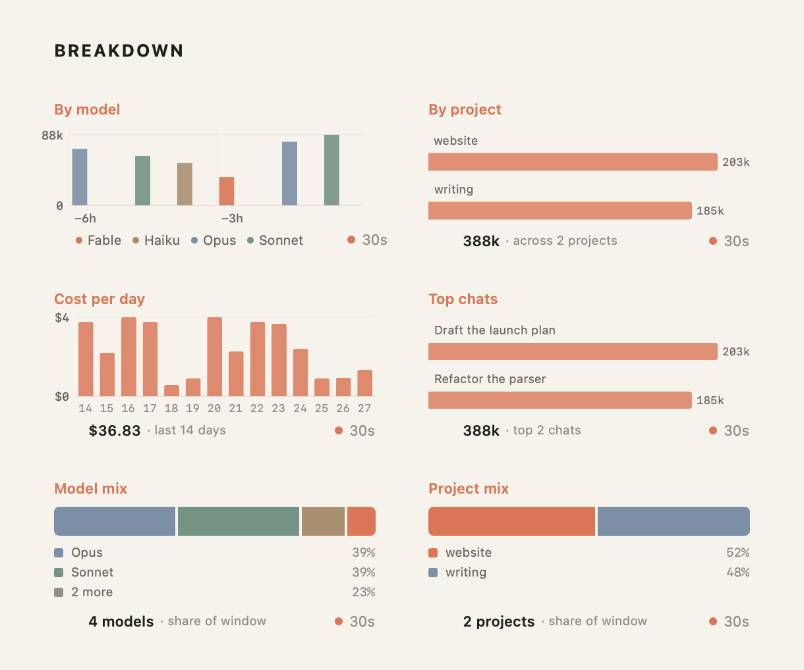

**Rhythm: when do you work.** Hour-of-day profile, a day-by-hour activity
heatmap, weekday profile, tokens per day, and every 5-hour session block
with how hard it was worked.

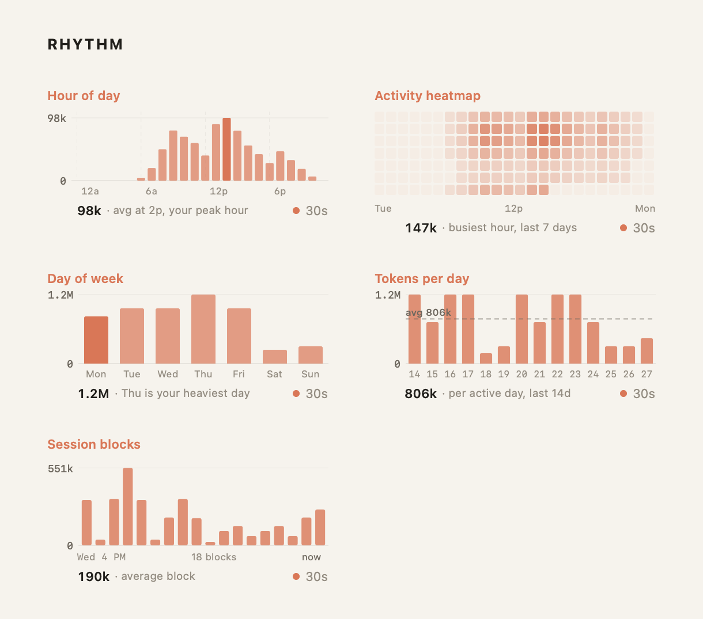

**Detail: what is the traffic made of.** Cache reads against fresh
tokens, input against output, and running spend with where it lands at
this rate.

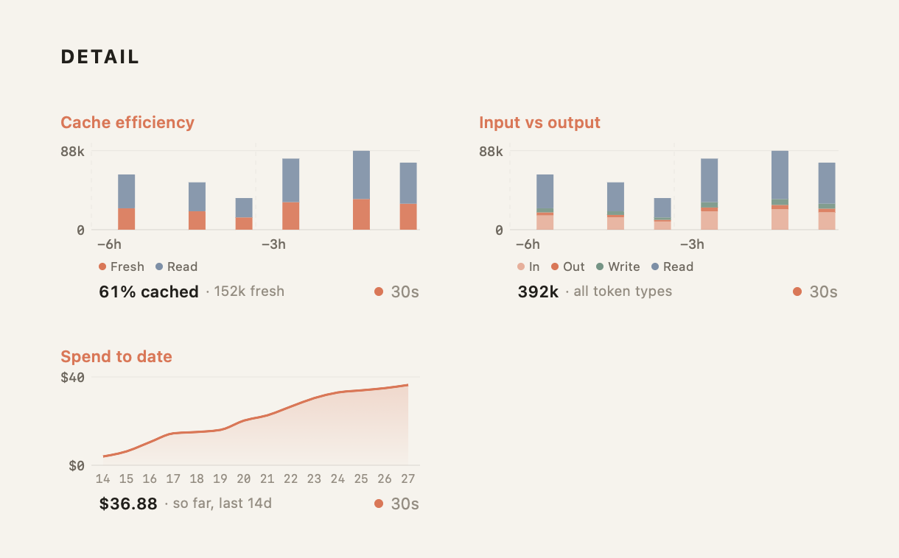

You never pick blind. The Settings gallery draws every chart before you
choose it, with realistic sample data or your own live data, so you know
exactly what each one will look like on your card.

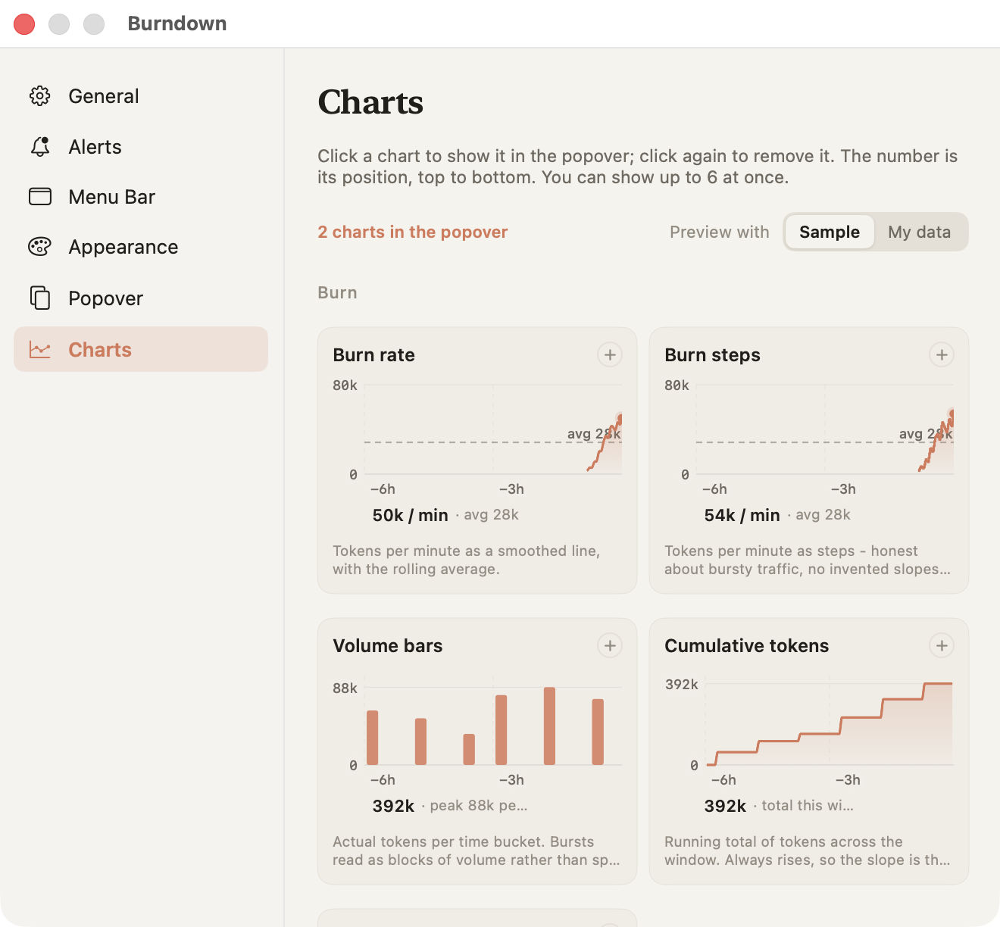

## Make it yours

Burndown is unusually deep on appearance, because a thing you look at
all day should look the way you want. And none of it is a skin pasted
over one fixed design: every color in the app flows from the active
palette, so a single choice recolors the card, the charts, the widget,
the floating window, and Settings together.

### More themes than you will get through

There are more than twenty color themes. Stone & Clay, the warm paper default, sits
alongside quiet lights like Paper White and Sage Linen, sun-warmed papers
like Sandstone, Harvest Amber, and Honey Oat, and true darks like
Midnight Ink, Forest Night, Ocean Deep, Espresso, and Electric Plum.
Here are twelve of them, the same card rendered through the app's own
palette code:

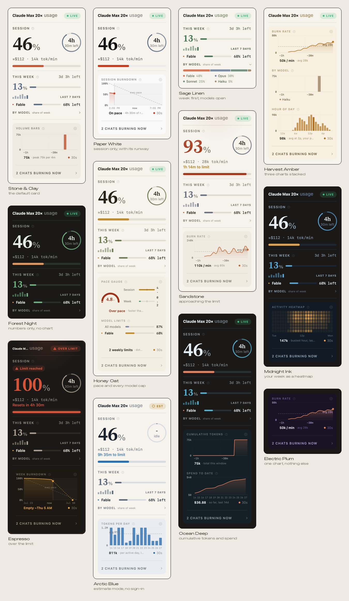

A separate Theme switch decides how a palette meets macOS: follow the
system's light and dark, or pin it to either. Several themes are designed
dark and stay dark.

### Real glass

The card's background is its own instrument. The Style control picks the
material: **Liquid Glass**, the real refractive material on macOS 26,
classic **Frosted** blur, or fully **Clear**. Five presets (Liquid,
Crystal, Frosted, Vivid, Minimal) are one-tap starting points, and then
the sliders take over: glass opacity, blur radius, saturation, a tint
drawn from the theme or your accent, border opacity and width, corner
radius, shadow, and overall window transparency.

You tune all of it against a live preview: a sample card rendered over a
checkerboard and a gradient, with a real contrast readout underneath
("AA 14.9:1, text stays legible"), so you can chase transparency as far
as you like and know the numbers will survive it. One link resets the
lot.

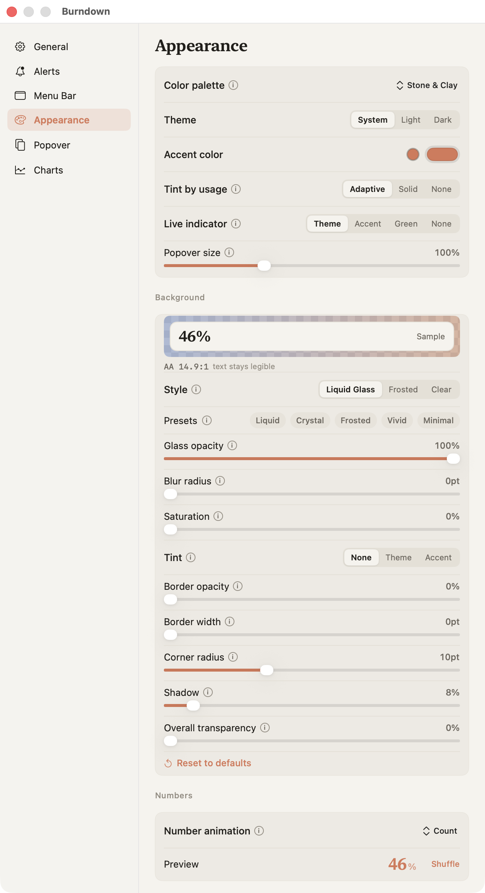

### Down to the last element

- **Accent color**, with your own custom color well, and **tint by
  usage**: Adaptive shifts the readout toward red as you near a limit,
  Solid keeps one fixed color, None stays neutral. The LIVE indicator
  has its own color choice too.
- **The card is editable.** The Popover pane is an editor for the card
  itself: every element has a visibility switch, whole sections reorder
  and collapse, and the card shrinks to fit whatever you keep. A popover
  size slider scales the whole thing, text and all, from 70 to 160
  percent.
- **A dozen number animations.** Roll, fade, pop, bounce, flip, count,
  and more, with a live preview and a Shuffle button so you can watch a
  digit change before you commit. Or none. Every animation steps aside
  automatically when macOS Reduce Motion is on.
- **Hover explanations** you can turn off once you know the app.

And you never spend a token auditioning any of this: **Demo Mode**, in
the right-click menu, synthesizes an organic burn so the flame, the
charts, and the card all move while you try themes and styles. It is
never persisted; flip it off and it is gone.

### The menu bar glyph

The glyph itself comes in a couple dozen styles across four families: live
styles that react to the token stream (an equalizer, a sparkline, a comet,
rolling digits, burning numerals), static gauges (ring, arc, pie, dial,
dot), plain text down to a bare percentage, and twin styles that show
session and week at once. Number format, time-to-reset, and digit weight
are all adjustable.

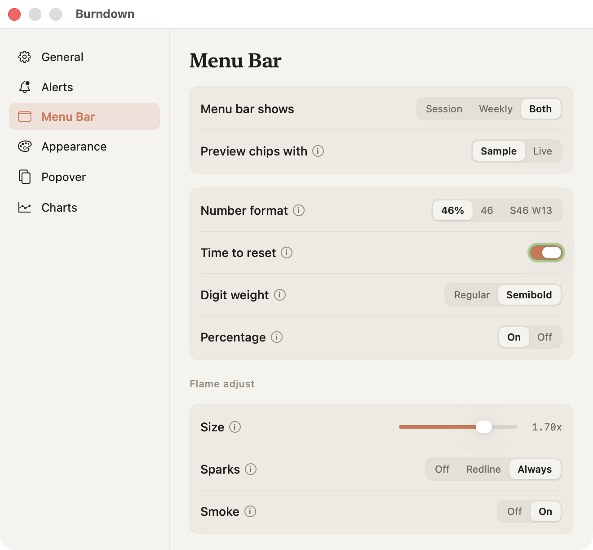

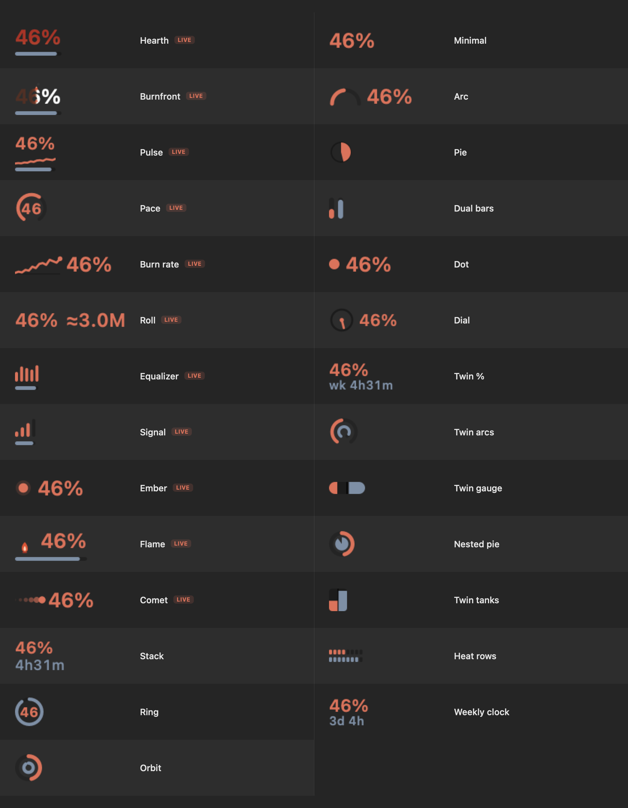

And yes, the flame. The signature style is a living flame that idles
quietly, grows and throws sparks as you work, and rages toward white-hot
near the limit. It is lovely, and it is one line in this README because
it is the charm, not the argument.

## Beyond the menu bar

- **The docked widget** clings to an edge of the Claude Desktop window,
  follows it as you move and resize, and appears only while Claude is
  frontmost. Six looks from slim meters to big numbers, draggable along
  the edge, lockable in place, scalable.
- **The Ember Line** is a quiet meter along a screen edge, on every
  display if you want: the bright span is what remains of your 5-hour
  session, and the glowing tip is the burn front, breathing faster as you
  burn hotter and turning red near the limit. Eight styles, from the full
  Ember Line to a thin filament or a single minimal node, with thickness,
  length, glow, sparks, and a hover readout.
- **A floating card**: the same card as the popover, pinned anywhere on
  your desktop, optionally always on top, with or without a title bar.

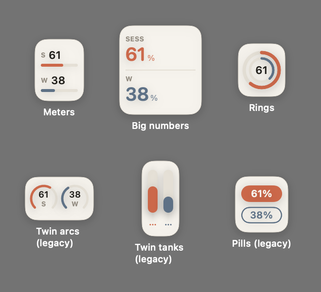

## In your terminal

Burndown treats the terminal as a first-class surface, not an
afterthought.

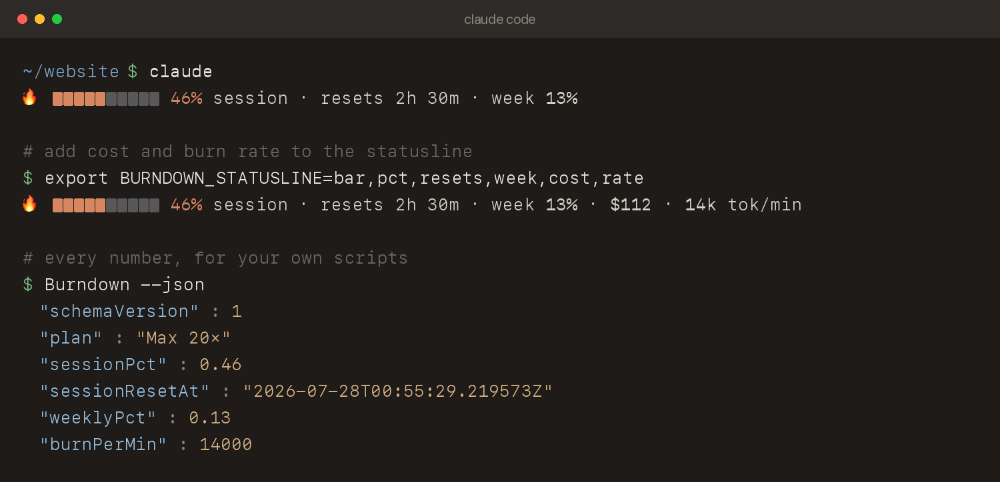

**Install Terminal Gauge**, one click in the right-click menu, writes a
small statusline script and points Claude Code at it, so your live limits
ride inside every Claude Code session: a flame, a ten-cell bar that
changes color as you close in on the limit, percentages, and reset times.
The install is reversible by design: your `~/.claude/settings.json` is
backed up once before the first install, and Remove Terminal Gauge
deletes only the statusline entry Burndown added, leaving any statusline
you wrote yourself untouched.

The line is yours to compose. Six segments exist and one environment
variable picks and orders them; a second strips the line down for
terminals without emoji or block glyphs:

```bash
export BURNDOWN_STATUSLINE=bar,pct,resets,week,cost,rate  # default: bar,pct,resets,week
export BURNDOWN_ASCII=1   # plain * and # / - instead of the flame and block cells
```

For your own scripts there are two doors. `Burndown --json` prints the
current numbers on demand, and `~/.config/burndown/burndown-live.json` is
rewritten on every refresh, so Raycast scripts, Stream Deck buttons, and
custom statuslines can read it with no process to spawn. Both speak the
same documented, versioned contract: `schemaVersion` (bumped only on a
breaking change), your plan, session and weekly usage as fractions
between 0 and 1, per-model fractions where your plan has them, both
reset times in ISO 8601, and the current burn rate. Keys are sorted and
the output is byte-stable, so it diffs and caches cleanly; a missing
optional field means "unknown", never zero. The contract has its own
headless test suite, so it will not drift under you.

## Why this and not a terminal tool

The terminal has good usage monitors: ccusage,
Claude-Code-Usage-Monitor, claude-meter. If you live in a terminal pane
all day, use them; they are solid, and Burndown credits them below.

The difference is posture. They are commands: you run them, read the
table, and the information is only as fresh as the last time you thought
to ask. Burndown is ambient. It sits at the edge of your vision, updates
itself, and interrupts you only at the thresholds you chose. Most
terminal tools also work from the local logs alone, which is an estimate;
Burndown's live mode shows the authoritative server-side numbers, the
same ones Claude's own usage page shows, with the exact local token
counts layered on top. And a native app can do what a TUI cannot:
notifications that find you away from the keyboard, a widget on the
Claude window, charts you can scrub with the pointer.

It is not either/or. Burndown will happily install its gauge into your
Claude Code statusline and feed your own scripts through the JSON API.

## Private by design

Everything stays on this Mac. Never synced, never uploaded. There is no
telemetry and there are no servers of ours.

- **Estimate mode (default on a fresh install)** reads the session logs
  Claude Code keeps under `~/.claude` and contacts nothing.
- **Live mode (opt-in)** signs in with your Claude account and reads your
  exact limits from Claude's usage endpoint. The only hosts the app ever
  talks to are Anthropic's (`claude.ai`, `api.anthropic.com`,
  `console.anthropic.com`).
- One exception, and it carries nothing about you: the updater asks
  `api.github.com` for the latest version number (daily if automatic
  updates are on, otherwise only when you click Check now), and downloads
  the release from `github.com` when you choose to install it.
- Signing out deletes the stored token, revokes the app's permission to
  borrow the Claude Code sign-in, and clears the diagnostic log. Local
  state lives in `~/.config/burndown/` (files private to your user,
  permissions 600); delete that folder to reset everything.
- Debug breadcrumbs (never secrets) go to
  `~/.config/burndown/live-debug.log`, size-capped. Full policy:
  [docs/PRIVACY.md](docs/PRIVACY.md) and the Privacy link in About.

<p align="center">
  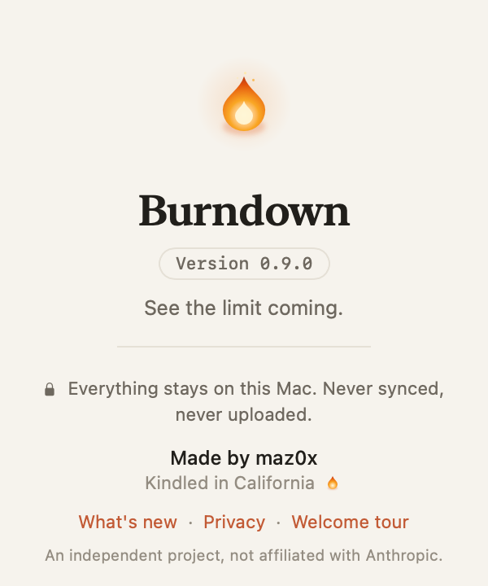
</p>

## How live mode works, with full disclosure

Live numbers come from Anthropic's OAuth usage endpoint, the same
server-side figures behind Claude's own Settings, Usage page:

```
GET https://api.anthropic.com/api/oauth/usage
  Authorization: Bearer <oauth access token>
  anthropic-beta: oauth-2025-04-20
  User-Agent: claude-code/<version>      # required, or you get 429s
```

- Sign-in uses the same public OAuth client Claude Code uses (PKCE,
  approved in your browser; the app never sees your password). The
  refreshed token pair is stored privately
  (`~/.config/burndown/token.json`, chmod 600) and never written back to
  your Keychain.
- Alternatively, "Use my Claude Code sign-in" borrows the credential
  Claude Code already keeps on this Mac, only with your explicit consent,
  and only while its own access token is still valid; Burndown never
  spends the CLI's refresh token, so it cannot invalidate your Claude
  Code login.
- The endpoint is undocumented and community-discovered; Anthropic could
  change or restrict it at any time. If that happens the app degrades to
  estimate mode and keeps working. In February 2026 Anthropic asked
  third-party CODING clients (which spend subscriptions via OAuth) to
  drop Claude OAuth; read-only monitors like this one operate publicly
  without known enforcement, but the call is Anthropic's. See
  [docs/TOS_NOTES.md](docs/TOS_NOTES.md) for the full picture. This
  project is not affiliated with, endorsed by, or sponsored by Anthropic.
  "Claude" and "Anthropic" are Anthropic PBC trademarks, used only to
  describe compatibility.
- The endpoint is polled gently (at most every ~20s, with backoff on
  429s); the UI refresh default is 60s, and smart refresh backs off
  further when you are idle. Token counts and cost estimates are layered
  in from the local `~/.claude/projects/**/*.jsonl` logs, the hybrid the
  ccusage maintainers recommend.

## Install

**Download:** grab the
[latest release](https://github.com/maz0x/burndown/releases/latest)
(universal, macOS 13+) and drop it in Applications. Releases are ad-hoc
signed until a Developer ID certificate lands, so macOS Gatekeeper warns
on first open. To open anyway: right-click Burndown.app, choose Open,
then Open again. Or:

```bash
xattr -d com.apple.quarantine Burndown.app
```

**Homebrew:**

```bash
brew install --cask --no-quarantine maz0x/tap/burndown
```

(`--no-quarantine` is what skips the Gatekeeper prompt on an ad-hoc signed
build. Drop it if you would rather right-click and Open once.)

**Build from source** (needs the Xcode Command Line Tools; no Gatekeeper
warning this way):

```bash
git clone https://github.com/maz0x/burndown && cd burndown
./build.sh
open Burndown.app
```

First launch shows a short welcome tour: what the app is, where its
numbers come from, how to connect (or not), and where everything lives.
"Open at login" registers a proper login item (SMAppService), so it
survives moving the app. If the menu bar item seems missing, a menu bar
manager (Bartender, Ice, etc.) may be hiding it. To uninstall: quit the
app, turn off Open at login, delete `Burndown.app` and
`~/.config/burndown/`.

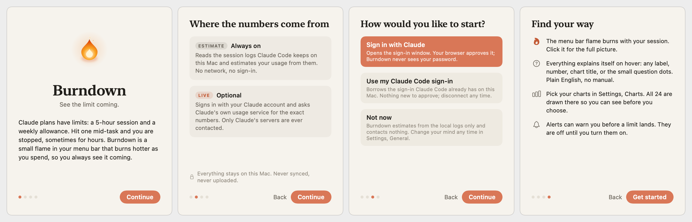

## Updates

Burndown keeps itself current. Once a day it asks GitHub for the latest
version number (nothing about you is sent), and if there is a newer build
it says so in the menu and in Settings. One click installs it: the
download is checked against its published SHA-256, its signature is
verified, the app is replaced in place, and Burndown restarts. Turn the
daily check off any time in Settings, General.

Because the update is fetched by the app rather than a browser, macOS
does not quarantine it, so updates install without any Gatekeeper prompt.

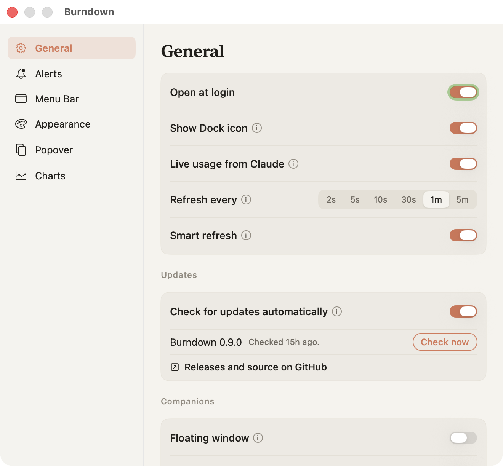

## FAQ

**Will it slow my Mac down?**
No. The popover tears its whole view tree down when it closes, which is
what keeps it near 0% CPU while hidden, and the app idles at a couple of
percent of one core with an animated fire style in the menu bar. Pick a
static style and even that goes away.

**I use Claude only in the browser or the desktop app. Does Burndown
still work?**
Live mode, yes: your limits are account-wide server-side numbers, so the
percentages, resets, forecasts, and alerts all work regardless of where
you use Claude. The estimate mode and the attribution features (per-chat,
per-project, the local charts) are built from the logs Claude Code keeps,
so they cover your Claude Code sessions.

**Do I have to sign in?**
No. A fresh install starts in estimate mode, reads only the local logs,
and contacts nothing. Live mode is a separate, explicit opt-in.

**Is my data safe?**
Everything stays on this Mac. No telemetry, no servers of ours; the only
hosts the app ever talks to are Anthropic's (live mode, opt-in) and
GitHub (a version number, for updates). The full policy is short and
worth reading: [docs/PRIVACY.md](docs/PRIVACY.md).

**Why does macOS warn me on first open?**
Releases are ad-hoc signed until a Developer ID certificate lands.
Right-click, Open, Open gets past it once and macOS remembers. Building
from source avoids the warning entirely.

**Will this get my account banned?**
Burndown is a read-only monitor: it never runs inference with your token
and never spends your subscription, it only asks "how much have I used".
Anthropic's February 2026 enforcement targeted a different class of tool
(third-party coding clients that spend subscriptions via OAuth), and
read-only monitors continue to operate publicly without known
enforcement. The call remains Anthropic's to make, which is exactly why
live mode is opt-in and the mechanism is disclosed in plain English. The
honest, sourced picture is in [docs/TOS_NOTES.md](docs/TOS_NOTES.md); if
the endpoint ever closes, the app degrades to estimate mode and keeps
working.

**Does it work on Pro? Max?**
Burndown does not hardcode plan shapes. It shows whatever limits your
account reports, including any per-model caps, and the Account window
has a refresh that picks up a plan change on the spot.

**Intel Macs?**
Yes. Releases are universal binaries (Apple Silicon and Intel), macOS 13
or later.

## Early days

Version 1.1 is young: it has been built and tested carefully, but it has
not yet met every Mac, every plan, and every setup out there. If
something looks wrong,
[open an issue](https://github.com/maz0x/burndown/issues) and
say what you saw. That is the fastest way to make it better for everyone.

## Development

- `bash build.sh`, then look for `✓ Built`.
- Sixteen headless test suites: `run-tests.sh` plus `run-*-tests.sh`
  (forecast, parsing, alerts, formats, chart data, pricing, aggregation,
  budget, runaway, pacing, model mix, export, recap, live contract, burn
  clock, update logic). `run-update-e2e.sh` additionally builds an
  intentionally old copy and lets it update itself from the live release.
- QA renders (no screen needed): `CUB_SNAP_POP`, `CUB_SNAP_CHARTS` +
  `CUB_PART=0..3`, `CUB_SNAP_SETTINGS` + `CUB_TAB=...`,
  `CUB_SNAP_ACCOUNT`, `CUB_SNAP_WELCOME`, each with optional `CUB_DARK=1`.

## Prior art

Burndown follows a trail the community blazed first: claude-meter,
minhvoio/ai-usage-monitors, thiswillbeyourgithub/claude_usage, ccusage,
and the Claude-Code-Usage-Monitor #202 writeup. If you live in the
terminal, those tools are good; use them.

## License

Apache License 2.0, see LICENSE. The name and the flame mark are not covered by it,
see TRADEMARK.md. Burndown is an independent project, not affiliated
with, endorsed by, or sponsored by Anthropic. "Claude" and "Anthropic"
are trademarks of Anthropic PBC, used only to describe compatibility.
